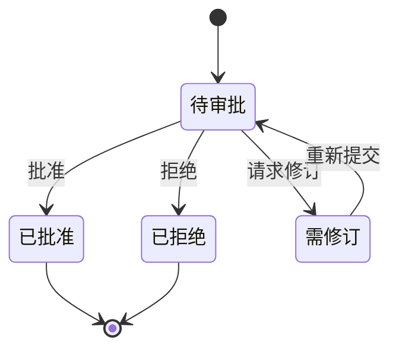

# 业务-系统-数据 三层分析 - Spec Workflow MCP 项目

## 一、业务层（Business Layer）

### 1.1 业务目标
- **提升开发效率**：通过标准化的规范驱动流程，减少需求理解偏差
- **增强协作质量**：建立清晰的审批和反馈机制
- **保证交付质量**：通过结构化文档确保开发符合预期
- **知识沉淀**：形成可追溯的项目文档体系

### 1.2 业务流程

#### 核心业务流程


#### 审批工作流


### 1.3 业务规则
1. **顺序约束**：必须按照需求→设计→任务的顺序创建文档
2. **审批机制**：关键文档需要经过审批才能进入下一阶段
3. **任务管理**：任务必须有明确的状态（待办/进行中/已完成）
4. **归档管理**：完成的规范可以归档，保持活跃项目清洁

### 1.4 业务价值链
- **输入**：产品需求、技术要求、项目目标
- **处理**：规范化文档创建、任务分解、进度跟踪
- **输出**：结构化规范文档、可执行任务列表、项目进度报告
- **价值**：提高开发效率、减少沟通成本、保证交付质量

## 二、系统层（System Layer）

### 2.1 系统架构

#### 整体架构
```
┌─────────────────────────────────────────┐
│          AI 客户端层                      │
│  (Claude/Cursor/Cline/Continue等)        │
└─────────────┬───────────────────────────┘
              │ MCP Protocol
┌─────────────▼───────────────────────────┐
│         MCP 服务器层                      │
│  ┌──────────────────────────────────┐   │
│  │  工具注册 │ 提示管理 │ 上下文引擎   │   │
│  └──────────────────────────────────┘   │
└─────────────┬───────────────────────────┘
              │
┌─────────────▼───────────────────────────┐
│         核心服务层                        │
│  ┌──────────────────────────────────┐   │
│  │ 会话管理│解析器│任务管理│归档服务    │   │
│  └──────────────────────────────────┘   │
└─────────────┬───────────────────────────┘
              │
┌─────────────▼───────────────────────────┐
│         仪表板服务层                      │
│  ┌──────────────────────────────────┐   │
│  │ HTTP服务│WebSocket│文件监控│审批    │   │
│  └──────────────────────────────────┘   │
└─────────────┬───────────────────────────┘
              │
┌─────────────▼───────────────────────────┐
│         前端展示层                        │
│  ┌──────────────────────────────────┐   │
│  │ React应用│路由│i18n│实时更新        │   │
│  └──────────────────────────────────┘   │
└─────────────────────────────────────────┘
```

### 2.2 系统模块

#### 核心模块
1. **MCP 服务器模块** (`src/server.ts`)
   - 处理 MCP 协议通信
   - 管理工具注册和调用
   - 维护项目上下文

2. **仪表板后端模块** (`src/dashboard/`)
   - Fastify HTTP 服务器
   - WebSocket 实时通信
   - 文件系统监控
   - 审批状态管理

3. **仪表板前端模块** (`src/dashboard_frontend/`)
   - React 单页应用
   - 实时数据展示
   - 多语言界面
   - 响应式设计

4. **核心服务模块** (`src/core/`)
   - 会话管理服务
   - 文档解析服务
   - 任务解析服务
   - 归档管理服务

5. **工具模块** (`src/tools/`)
   - 规范创建工具
   - 状态查询工具
   - 任务管理工具
   - 审批工具

### 2.3 系统接口

#### 外部接口
- **MCP 协议接口**：与 AI 客户端通信（stdio）
- **HTTP API**：仪表板数据接口
- **WebSocket**：实时更新推送
- **文件系统**：本地文件读写

#### 内部接口
- **工具上下文接口**：统一的工具调用上下文
- **事件总线**：组件间通信
- **解析器接口**：文档解析和验证

### 2.4 系统特性
- **实时性**：WebSocket 推送实现毫秒级更新
- **可扩展性**：模块化设计，易于添加新工具
- **国际化**：支持11种语言
- **跨平台**：支持 Windows、macOS、Linux
- **多客户端**：支持7种主流 AI 开发工具

## 三、数据层（Data Layer）

### 3.1 数据模型

#### 核心数据实体
```typescript
// 规范文档
interface Spec {
  name: string;
  requirements: Document;
  design: Document;
  tasks: TaskList;
  status: 'active' | 'archived';
  createdAt: Date;
  updatedAt: Date;
}

// 任务
interface Task {
  id: string;
  title: string;
  description: string;
  status: 'pending' | 'in-progress' | 'completed';
  dependencies: string[];
  assignee?: string;
}

// 审批记录
interface Approval {
  id: string;
  documentPath: string;
  status: 'pending' | 'approved' | 'rejected' | 'revision_requested';
  requestedAt: Date;
  respondedAt?: Date;
  feedback?: string;
}

// 会话信息
interface Session {
  dashboardUrl: string;
  startedAt: Date;
  projectPath: string;
}
```

### 3.2 数据存储

#### 文件系统结构
```
.spec-workflow/
├── steering/                 # 指导文档
│   ├── product.md           # 产品愿景
│   ├── tech.md             # 技术决策
│   └── structure.md        # 项目结构
├── specs/                   # 规范文档
│   └── {spec-name}/
│       ├── requirements.md # 需求文档
│       ├── design.md       # 设计文档
│       └── tasks.md        # 任务列表
├── archived/               # 归档规范
│   └── {spec-name}/
├── approval/               # 审批记录
│   └── {spec-name}/
│       └── {document-id}.json
├── session.json           # 会话信息
└── config.toml           # 配置文件
```

### 3.3 数据流转

#### 数据生命周期
1. **创建阶段**：通过 MCP 工具创建文档和数据
2. **更新阶段**：文件系统监控检测变化
3. **传输阶段**：WebSocket 推送更新到前端
4. **展示阶段**：前端实时渲染最新数据
5. **归档阶段**：完成的规范移至归档目录

#### 数据同步机制
- **文件监控**：使用 chokidar 监控文件变化
- **事件广播**：通过 WebSocket 广播更新事件
- **状态管理**：前端使用 React 状态管理
- **缓存策略**：内存缓存提高读取性能

### 3.4 数据安全与完整性

#### 数据保护措施
1. **本地存储**：所有数据存储在本地，无云端依赖
2. **原子操作**：文件写入使用原子操作，避免数据损坏
3. **备份机制**：归档系统自动备份完成的规范
4. **访问控制**：基于文件系统权限的访问控制

#### 数据验证
- **格式验证**：Markdown 文档格式验证
- **结构验证**：任务依赖关系验证
- **状态验证**：审批状态转换验证
- **完整性检查**：会话信息完整性检查

## 总结

### 三层协同关系
- **业务层**定义了系统的价值和流程
- **系统层**实现了业务需求的技术方案
- **数据层**支撑了系统运行和业务数据持久化

### 关键成功因素
1. **业务层**：清晰的工作流程和审批机制
2. **系统层**：模块化架构和实时通信能力
3. **数据层**：简单可靠的文件存储和数据同步

### 优化方向
1. **业务层**：增加更多协作功能，如评论和讨论
2. **系统层**：提升性能，支持大型项目
3. **数据层**：增加数据分析和报表功能